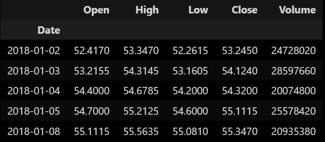
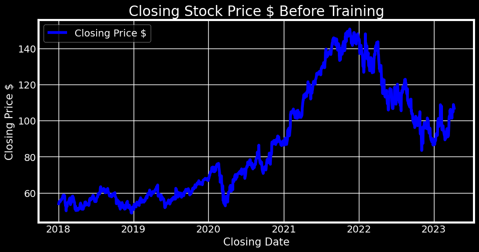
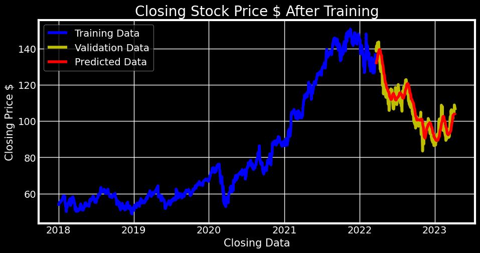

# Stock Price Prediction Using ML : SPP

## `SPP : Jupyter Notebook Version`

### Fetching and Preprocessing Data

- To fetch the ticker data we use stooq
- Stooq returns a DataFrame with the recent closing price.
- First thing we need to do is to invert the sequence.
- The fetched data is dataframe format but we will be only working with the closing prices
&nbsp;
  
&nbsp;
  

&nbsp;

- Preprocessing the data
  - From the dataframe we select the closing price
  - Splitting the data into train and test 80/20
  - Scaling the data with MinMaxScaler

## Training the Model

- The data we are using is of a sequential nature and we want to predict the next day price.
- We opted for a Sequential model that has 5 layers:
  - LSTM_128 - a Long Short-Term Memory layer with 128 units
  - Dropout_0.2 - a Dropout layer with a rate of 0.2
  - LSTM_64 - a Long Short-Term Memory layer with 64 units
  - LSTM_32 - a Long Short-Term Memory layer with 32 units
  - Denso_16 - a Dense layer with 16 units
  - Dense_1 - a Dense layer with 1 unit, which is the output layer.

Model Summary:
_________________________________________________________________
| Layer (type)   |             Output Shape      |        Param # |
|----------------|-------------------------------|-----------------
| LSTM_128 (LSTM)         |    (None, 60, 128)     |      66560
| Dropout_0.2 (Dropout)   |    (None, 60, 128)     |      0
| LSTM_64 (LSTM)          |    (None, 60, 64)      |      49408
| LSTM_32 (LSTM)          |    (None, 32)          |      12416
| Denso_16 (Dense)        |    (None, 16)          |      528
| Dense_1 (Dense)         |    (None, 1)           |      17        |

Total params: 128,929
Trainable params: 128,929
Non-trainable params: 0

## Model Evaluation

- To evaluate the model we used Root Mean Squared Error (RMSE)
- RMSE score is 5.58.
- If we select a date and we try to predict the price, our model achieve an accuracy of 98.70% (We compared the predicted model price with the real price.)

## Model Visualization after Training

- To visualize the model we plotted the training data (blue) 80% and validation data (yellow) 20% vs the predicted data (in red) as shown in the image below.

